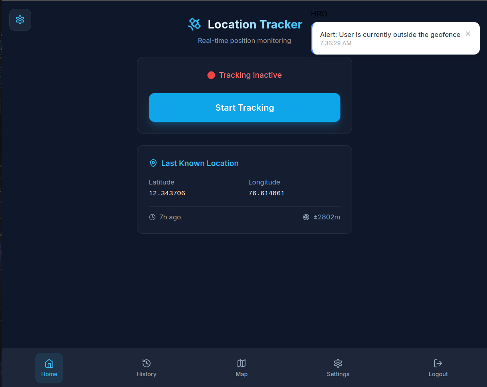
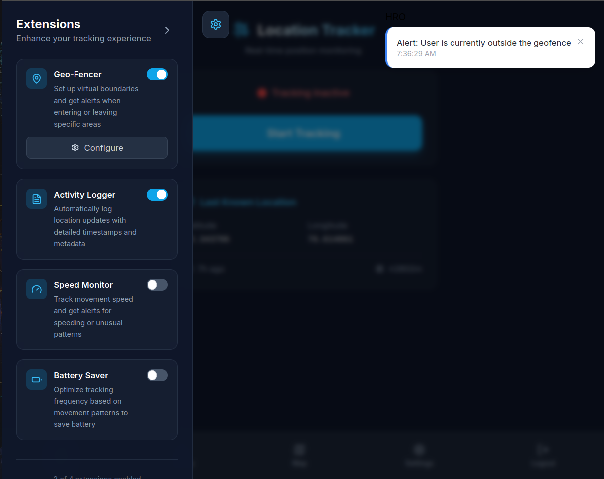
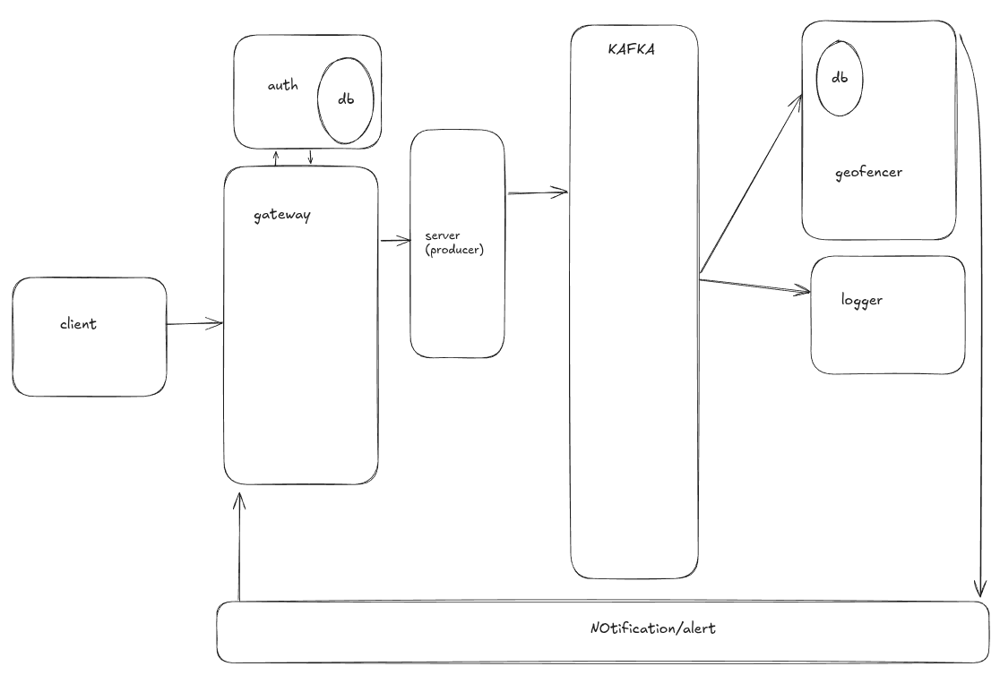

# SAFETRACE Real-Time Location Tracking System (Go + Kafka + React)

Real-Time Location Tracker is a modular event-driven system that continuously tracks user locations from a frontend app, streams the data to a Go backend, and publishes it to Kafka for real-time processing. Custom Kafka consumers handle features like geo-fencing alerts, proximity detection, and location logging, making it ideal for learning Kafka, Go, and real-time architectures.
The project is built to learn kafka.
This is a initial version.
I have built a simple extension for location logging.
In the future, based on circumstances i may continue to build it.
I have used both `fiber` and `gin` since it was build on different timings. And i was learning.
If you are locally running the project use docker.

---




---

## Features

- Real-time location tracking from frontend
- Backend API with Go Fiber to receive & validate dataQ
- Kafka integration using `segmentio/kafka-go`
- Plug-and-play Kafka consumers:
- Geo-fencing alerts
- Meetup proximity detection
- Location logging to file
- Real-time updates to frontend via SSE

---

## PORTS:

- auth :3001
- client:5173
- gateway:8080
- server:5000
- geo-fencer:3002
- alert:3003

---

## Architecture Overview



## Running the Project(Docker)

Most preferred way. Since the `docker-compose.yml` is perfectly composed.

```bash
docker compose up -d
```

## Running the Project(Local)

Need to change the `docker-compose.yml` and `.env` files to suit running the code locally.

### 1. Clone and Setup

```bash
git clone https://github.com/jsndz/safetrace
cd safetrace
```

### 2. Start Go Backend (Producer API)

```bash
cd cmd/server
go run main.go
```

### 3. Start Kafka Consumer Extensions

Each consumer can be run independently. For example:

```bash
cd location_logger
go run main.go
```

```bash
cd geo-fencer
go run cmd/server/main.go
```

### 4. Alert Service

```bash
cd alert
go run cmd/server/main.go
```

### 5. Auth Service

```bash
cd auth
go run cmd/server/main.go
```

### 6. Run Frontend

```bash
cd client
npm install
npm run dev
```

---

## Kubernetes (Local)

### 1. Start Minikube

```bash
minikube start
```

> This starts a local Kubernetes cluster with Docker or your configured VM driver.

---

### 2. Enable Ingress Controller (if not already)

```bash
minikube addons enable ingress
```

> Required to route traffic from `safetrace.local` to your services.

---

### 3. Deploy your Kubernetes manifests

```bash
cd k8s
bash ../scripts/k8s_deploy.sh
```

> This should create Deployments, Services, and an Ingress (assumed).

---

### 4. Edit your `/etc/hosts`

```bash
sudo nano /etc/hosts
```

Add this line:

```
127.0.0.1    safetrace.local
```

> Do **not** use `192.168.49.2` here unless you're not tunneling.

---

### 5. Start the Minikube Tunnel

```bash
minikube tunnel
```

> This exposes `LoadBalancer` services on your localhost (needed for Ingress).

> **Keep this terminal open** — closing it stops the tunnel.

---

### 6. Verify the services and ingress

Check that Ingress and your app are up:

```bash
kubectl get ingress
kubectl get svc
kubectl get pods
```

And test:

```bash
curl -v http://safetrace.local/
```

If you get a response (HTML or JSON), it's working

---

### Troubleshooting Tips

- If `curl` times out:

  - Ensure `minikube tunnel` is running
  - Check `kubectl describe ingress` for rules and backend service
  - Ensure the service you’re routing to has matching `selector` and `targetPort`

---

## Extensions (Kafka Consumers)

| Extension         | Description                            |
| ----------------- | -------------------------------------- |
| Geo-Fence Checker | Sends alert if user exits allowed area |
| Location Logger   | Stores location history in file        |

---

## Kafka Topics

- `location` – main topic for location updates
- `alerts` – triggered by consumers like GeoFence

---

## Tech Stack

- **Frontend**: React + Vite
- **Backend**: Go + Fiber + Kafka producer
- **Messaging**: Apache Kafka (via `kafka-go`)
- **DB**: Postgres
- **Notification**: SSE

---

## Learning Outcomes

- Kafka producer-consumer pattern
- Event-driven architecture
- Real-time geospatial data processing
- Modular backend service design in Go

---

## What i learned

- kafka lets you have multiple consumers
- make the consumers scale horizontally by increasing partitions and consumers
- Each consumer can be grouped if all consumers in a single group queue different group pub-sub
- high throughput
- rewinding option is available
- SSE

---

## Contributing

Pull requests welcome. Fork the repo, create a new branch, and submit a PR.

---

## Contact

Built by [jsndz](https://github.com/jsndz)

---

```

```
