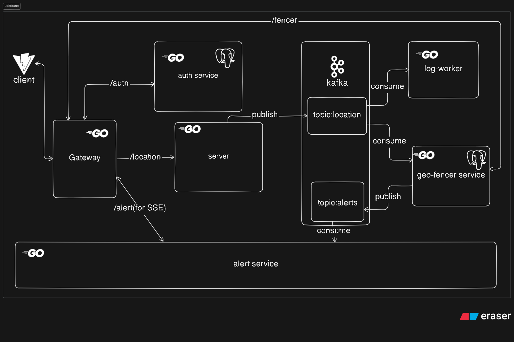

# SAFETRACE Real-Time Location Tracking System (Go + Kafka + React)

Real-Time Location Tracker is a modular event-driven system that continuously tracks user locations from a frontend app, streams the data to a Go backend, and publishes it to Kafka for real-time processing. Custom Kafka consumers handle features like geo-fencing alerts, proximity detection, and location logging, making it ideal for learning Kafka, Go, and real-time architectures.
The project is built to learn kafka.
This is a initial version.
I have built a simple extension for location logging.
In the future, based on circumstances i may continue to build it.
I have used both `fiber` and `gin` since it was build on different timings. And i was learning.
If you are locally running the project use docker.

---




---

## Features

- Real-time location tracking from frontend
- Backend API with Go Fiber to receive & validate dataQ
- Kafka integration using `segmentio/kafka-go`
- Plug-and-play Kafka consumers:
- Geo-fencing alerts
- Meetup proximity detection
- Location logging to file
- Real-time updates to frontend via SSE

---

## PORTS:

- auth :3001
- client:5173
- gateway:8080
- server:5000
- geo-fencer:3002
- alert:3003

---

## Architecture Overview


## Running the Project(Docker)

Most preferred way. Since the `docker-compose.yml` is perfectly composed.

```bash
docker compose up -d
```

## Development Environment Setup (Devbox)

This project uses [Devbox](https://www.jetpack.io/devbox) to manage development dependencies and ensure a consistent environment across different machines.

### Install Devbox

```bash
curl -fsSL https://get.jetpack.io/devbox | bash
```

### Enter Devbox Shell

```bash
devbox shell
```

This automatically installs and configures all required tools:
- Go (latest)
- Node.js 20
- Kubernetes tools (kubectl, kind, k9s, helm, kustomize)
- Task runner (go-task)
- Other utilities (gh, jq, yq, envsubst)

Once in the devbox shell, you can use `task` commands (see Taskfile section below) for Kubernetes operations.

## Taskfile (Task Runner)

The project uses [Task](https://taskfile.dev/) to automate common operations. Taskfile provides convenient shortcuts for Kubernetes management.

### Installation

Task is automatically installed when you enter the devbox shell. If not using devbox:

```bash
# macOS
brew install go-task/tap/go-task

# Linux
sh -c "$(curl --location https://taskfile.dev/install.sh)" -- -d

# Or via npm
npm install -g @task/cli
```

### Common Task Commands

**Kind Cluster:**
```bash
task kind:create-cluster       # Create Kubernetes cluster
task kind:enable-loadbalancer  # Enable LoadBalancer (keep running)
task kind:delete-cluster       # Delete cluster
```

**Kubernetes Resources:**
```bash
task k8s:apply-all            # Apply all resources
task k8s:delete-all           # Delete all resources
task k8s:apply-namespace      # Create namespace
task k8s:apply-secrets        # Apply secrets
task k8s:apply-configmap      # Apply ConfigMap
task k8s:apply-databases      # Apply PostgreSQL & Kafka
task k8s:apply-services       # Apply services
task k8s:apply-deployments    # Apply deployments
```

**Status & Debugging:**
```bash
task k8s:get-all              # Show all resources
task k8s:get-pods             # List pods
task k8s:get-services          # List services
task k8s:logs POD=gateway-xxx # Stream pod logs
```

**Port Forwarding:**
```bash
task k8s:port-forward-gateway  # Forward gateway (8080)
task k8s:port-forward-auth     # Forward auth service
task k8s:port-forward-server   # Forward server service
```

See `taskfile.yaml` for all available commands.

## Running the Project(Local)

Need to change the `docker-compose.yml` and `.env` files to suit running the code locally.

### 1. Clone and Setup

```bash
git clone https://github.com/jsndz/safetrace
cd safetrace
```

### 2. Start Go Backend (Producer API)

```bash
cd cmd/server
go run main.go
```

### 3. Start Kafka Consumer Extensions

Each consumer can be run independently. For example:

```bash
cd location_logger
go run main.go
```

```bash
cd geo-fencer
go run cmd/server/main.go
```

### 4. Alert Service

```bash
cd alert
go run cmd/server/main.go
```

### 5. Auth Service

```bash
cd auth
go run cmd/server/main.go
```

### 6. Run Frontend

```bash
cd client
npm install
npm run dev
```

---

## Kubernetes Deployment (Kind)

The project uses [Kind](https://kind.sigs.k8s.io/) (Kubernetes in Docker) for local Kubernetes development. Configuration is managed via Taskfile and Devbox.

### Prerequisites

- Docker installed and running
- Devbox shell (recommended) or manually install: kind, kubectl

### Quick Start

1. **Enter Devbox shell** (recommended):
   ```bash
   devbox shell
   ```

2. **Create Kind cluster:**
   ```bash
   task kind:create-cluster
   ```
   This creates a 3-node cluster (1 control-plane, 2 workers) as configured in `kind-config.yaml`.

3. **Enable LoadBalancer support:**
   ```bash
   task kind:enable-loadbalancer
   ```
   This runs `cloud-provider-kind` to enable LoadBalancer services in KinD.
   
   **Important:** Keep this process running (or run in background). This is required for LoadBalancer services.

4. **Apply all Kubernetes resources:**
   ```bash
   task k8s:apply-all
   ```
   This creates:
   - Namespace: `safetrace`
   - Secrets and ConfigMaps
   - PostgreSQL databases (for auth and geo-fencer services)
   - Kafka (StatefulSet with persistent storage)
   - All microservices (gateway, auth, server, geo-fencer, alert, logger)
   - Services for internal communication

5. **Verify deployment:**
   ```bash
   task k8s:get-all
   # Or check specific resources:
   task k8s:get-pods
   task k8s:get-services
   ```
   
   Wait for all pods to be in `Running` state:
   ```bash
   kubectl get pods -n safetrace -w
   ```

6. **Access the services:**

   **Option A: Port Forward Gateway**
   ```bash
   task k8s:port-forward-gateway
   ```
   Then access at `http://localhost:8080`

   **Option B: Use LoadBalancer (if LoadBalancer provider is running)**
   ```bash
   kubectl get svc -n safetrace
   # Gateway service should have an external IP
   ```

### Using Taskfile for Common Operations

**Deployment Management:**
```bash
# Restart a deployment
task k8s:rollout-restart DEPLOYMENT=gateway

# Check rollout status
task k8s:rollout-status DEPLOYMENT=gateway
```

**View Logs:**
```bash
# Get pod name first
task k8s:get-pods

# Stream logs
task k8s:logs POD=gateway-xxx-xxx
```

**Port Forwarding:**
```bash
task k8s:port-forward-gateway  # Gateway on :8080
task k8s:port-forward-auth     # Auth on :8081
task k8s:port-forward-server   # Server on :8082
```

### Cleaning Up

```bash
# Delete all Kubernetes resources
task k8s:delete-all

# Delete the Kind cluster
task kind:delete-cluster
```

### Troubleshooting

**Pods not starting:**
```bash
# Check pod status and events
task k8s:describe RESOURCE_TYPE=pod RESOURCE_NAME=<pod-name>

# View logs
task k8s:logs POD=<pod-name>

# Check all resources
task k8s:get-all
```

**Services not accessible:**
- Ensure LoadBalancer provider is running: `task kind:enable-loadbalancer`
- Check service endpoints: `kubectl get endpoints -n safetrace`
- Verify service selectors match pod labels

**Database connection issues:**
- Wait for PostgreSQL pods to be ready
- Check database credentials in secrets: `kubectl get secrets -n safetrace`
- Verify ConfigMaps: `kubectl get configmaps -n safetrace`

**Kafka not working:**
- Ensure Kafka StatefulSet is ready: `kubectl get statefulset -n safetrace`
- Check Kafka service: `kubectl get svc kafka-service -n safetrace`
- View Kafka pod logs: `task k8s:logs POD=kafka-0`

### Alternative: Minikube

If you prefer Minikube instead of Kind:

1. **Start Minikube:**
   ```bash
   minikube start
   ```

2. **Enable Ingress:**
   ```bash
   minikube addons enable ingress
   ```

3. **Deploy resources:**
   ```bash
   task k8s:apply-all
   ```

4. **Start Minikube tunnel** (for LoadBalancer services):
   ```bash
   minikube tunnel
   ```

5. **Access via Ingress** (if configured):
   - Edit `/etc/hosts`: `127.0.0.1 safetrace.local`
   - Access: `http://safetrace.local`

---

## Extensions (Kafka Consumers)

| Extension         | Description                            |
| ----------------- | -------------------------------------- |
| Geo-Fence Checker | Sends alert if user exits allowed area |
| Location Logger   | Stores location history in file        |

---

## Kafka Topics

- `location` – main topic for location updates
- `alerts` – triggered by consumers like GeoFence

---

## Tech Stack

- **Frontend**: React + Vite
- **Backend**: Go + Fiber + Kafka producer
- **Messaging**: Apache Kafka (via `kafka-go`)
- **DB**: Postgres
- **Notification**: SSE

---

## Learning Outcomes

- Kafka producer-consumer pattern
- Event-driven architecture
- Real-time geospatial data processing
- Modular backend service design in Go

---

## What i learned

- kafka lets you have multiple consumers
- make the consumers scale horizontally by increasing partitions and consumers
- Each consumer can be grouped if all consumers in a single group queue different group pub-sub
- high throughput
- rewinding option is available
- SSE

---

## Contributing

Pull requests welcome. Fork the repo, create a new branch, and submit a PR.

---

## Contact

Built by [jsndz](https://github.com/jsndz)

---

```

```
